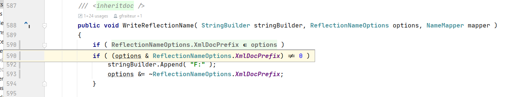

**Readable bitwise operations (Rider plugin)**

Folds simple bitwise operations on enums with `[Flags]` into simpler green text that looks like this:



For example, it turns
```c#
if ( (options & ReflectionNameOptions.XmlDocPrefix) != 0 )
```
into
```c#
if ( ReflectionNameOptions.XmlDocPrefix ∈ options )
```
and it turns

```c#
if ( (options & ReflectionNameOptions.XmlDocPrefix) == 0 )
```
into
```c#
if ( ReflectionNameOptions.XmlDocPrefix ∉ options )
```

This helps you avoid errors and you don't need to think as long about what `!=` or `==` actually means. It works on any enum with `[Flags]`.